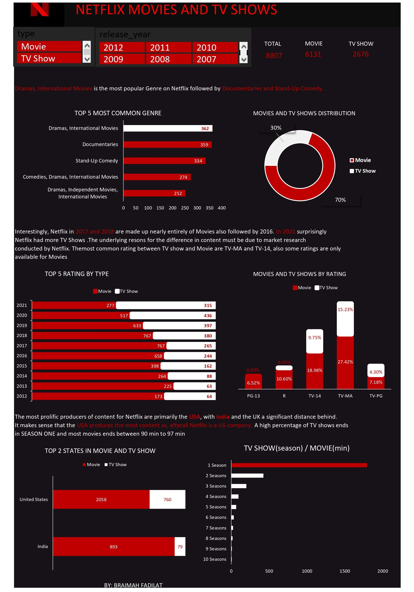

# Netflix Movie and TV Show

Netflix is an American subscription video on-demand over-the-top streaming service owned and operated by Netflix, Inc., a company based in Los Gatos, California. It offers films and television series from various genres, and it is available in multiple languages.They have over 8000 movies or tv shows available on their platform, as of mid-2021, they have over 200M Subscribers globally.

## Introduction
I came across this fascinating Netflix dataset which i downloaded from Kaggle just after i completed my Excel Fundamentals for Data Analysis Course on Coursera. To practicalized the skills i gained from the course, i decided to make more sense to the dataset by cleaning and visualizing it.
The main aim of this project is to show my data cleaning and storytelling skills. find dataset [here](https://www.kaggle.com/datasets/shivamb/netflix-shows)

## Data Analysis Process
A series of steps must be carried out in order to interpret this information. Finding these procedures is crucial because each step is important in ensuring that the data is processed correctly in order to provide relevant and useful information. The steps I did in this process are listed below.:

- Excel concept applied
- Problem Statement
- Data Cleaning Process
- Data Visualization
- Communications and Insights

### Excel concept applied are:
- Power Query
- Tables
- Pivot Tables

## Problem Statement
To analyse this data i would like to highlight the main focus, reasons and questions i will be answering with the data analysis process to open up avenue for product improvement, services, and communication. This analysis will focus on:
- Understanding what content is available in different countries
- understanding the percentage of movie and TV show. Are there more TV shows available on Netflix?
- How have Netflix improve over the years
- What are the most common Genre on Netflix in recent years.

## Data Cleaning Process
This dataset was thouroghly cleaned and transformed with Power Query Editor in Excel. The dateaset which contain 8807 observations(rows) with 12 variables(columns) where trimmed, cleaned, changed datatype, replaced unwanted values and made first row as headers. 
Some columns like Cast, Country and Director contained null values. The country column was replaced with the mode which is the most frequent country (United States). The null values in Cast Column and Director Column were not much which was replaced with empty and removed as empty.

## Data Visualization
For visualisation, I exported the csv file to Excel Power Query and I created a pivot tables to better display my findings and communicate the analysis.

## Insights
### Movie and TV Show Distribution
In general there are more movies available on Netflix than TV Shows. There are 70% Movies and 30% TV Shows but nexflix upload in years might varies as there might be some years with more TV Shows than Movies.

### Genre
To answer the big question on what are the most available Genre on Netflix i decide's to show how nexflix upload Movies based on Genre. It shows that ***Drama, Internation Movies*** followed by ***Documentary*** are the most common Genre on Netflix.

### Rating
The most common rating between TV show and Movie are TV-MA and TV-14, also some ratings are only for Movies. Tv-MA has the highest rating in both Movie and TV Show

### Movie and TV Show availaibility
Interestingly, Netflix in 2017 and 2018 are made up nearly entirely of Movies also followed by 2016. In 2021 surprisingly Netflix had more TV Shows .The underlying resons for the difference in content must be due to market research conducted by Netflix.

### States
The most prolific producers of content for Netflix are primarily the USA, with India and the UK a significant distance behind. It makes sense that the USA produces the most content as, afterall Netflix is a US company

## Conclusion
- More ratings should be made available for TV Shows to allow viewers express their comfort or displeasure of a TV show
- Movies other than ***Drama, Internation Movies*** should me made available to enable viewers have wide range of selection.
- Tv Show's should not be longer than 6 seasons so viewers wont find it boring because of its lenghty episodes and seasons.

*__STAY SAFE TILL YOU HEAR FROM ME AGAIN__* 😙 
               BRAIMAH FADILAT
